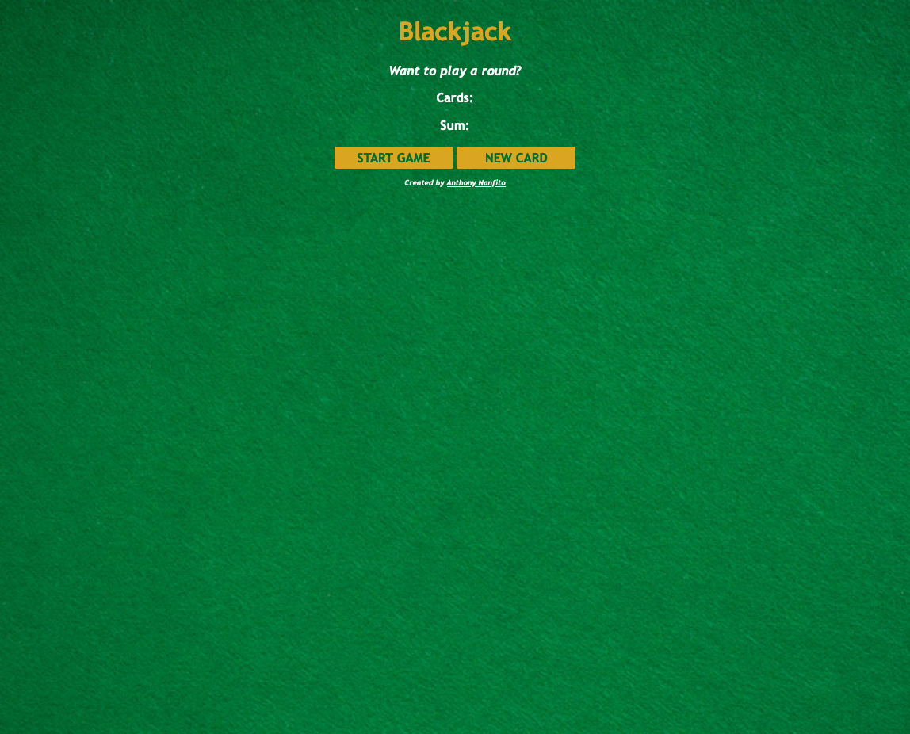
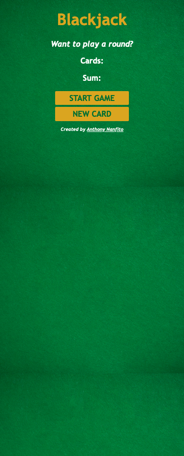

# Blackjack App

A basic Blackjack app created with HTML, CSS, and JavaScript as part of [Scrimba's Frontend Career Path](https://scrimba.com/learn/frontend).

# Contents
- [Screenshot](#screenshot)
  - [Desktop](#desktop)
  - [Mobile](#mobile)
- [Status](#status)
- [Connect](#connect)

## Screenshot

### Desktop 

### Mobile

## Status

A live version of the app can be viewed at: [https://ananfito.github.io/basic-blackjack/](https://ananfito.github.io/basic-blackjack/)

## Connect

- [LinkedIn](https://linkedin.com/in/anthonynanfito)
- [Portfolio](https://ananfito.github.io)
- [Blog](https://ananfito.hashnode.dev)
